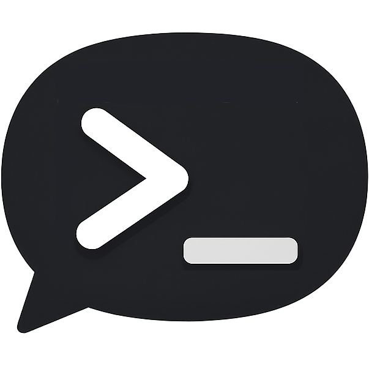

# CliDeck macOS Tray Plugin

A lightweight, native macOS menu bar integration for [CliDeck](https://clideck.dev/). Keep an eye on your AI coding agents without leaving your current window.



## Features

- **Menu Bar Icon:** The CliDeck logo sits right in your Mac's menu bar.
- **Live Status:** Click the icon to see exactly which agents are working (🟢) and which are idle (⚪).
- **Quick Access:** Open the CliDeck dashboard in your default browser with one click (dynamically detects your custom port).
- **Native Notifications:** Get a macOS desktop notification when an agent finishes its work and becomes idle.
- **Quit CliDeck:** Easily shut down the CliDeck server directly from the tray.

## Installation

### Option 1: Via CliDeck Plugins Directory (Recommended)
1. Open your CliDeck dashboard (`http://localhost:4000`).
2. Go to the **Plugins** panel (circuit icon in the sidebar).
3. Find **macOS Menu Bar** in the community directory and click **Install**.

### Option 2: Manual Installation
1. Clone this repository into your CliDeck plugins directory:
   ```bash
   cd ~/.clideck/plugins
   git clone https://github.com/mohith-das/clideck-macos-tray.git macos-tray
   ```
2. Install the dependencies:
   ```bash
   cd macos-tray
   npm install
   ```
3. Restart CliDeck.

## Optional: Native Dock Launcher App

If you'd like a beautiful native macOS app in your Dock (with a customized squircle icon) that stays perfectly in sync with the Menu Bar tray and automatically opens the browser when clicked:

1. Open your terminal and navigate to the plugin's launcher directory:
   ```bash
   cd ~/.clideck/plugins/macos-tray/launcher
   ```
2. Run the build script to compile the Swift application:
   ```bash
   ./build.sh
   ```
3. Drag the generated `build/CliDeck.app` into your `/Applications` folder!

*Note: Quitting the app from the Dock will safely stop the CliDeck server, and vice versa—quitting from the Menu Bar tray will also remove the launcher from your Dock!*

## Settings

You can configure the plugin directly from the CliDeck Plugins panel:
- **Show Menu Bar Icon (Toggle):** Enable or disable the menu bar tray icon at any time without restarting the server.

## Requirements

- macOS
- Node.js (running CliDeck)

## How it works

This plugin uses the standard CliDeck Plugin API. It runs entirely on the backend using `systray` and `node-notifier` to render native UI components without requiring a heavy Electron wrapper. The optional launcher is a compiled native Swift application.

## Known limitations

Due to a hook environment variable inheritance issue in CliDeck, working/idle status updates work reliably only for OpenCode agents. Claude Code and Gemini CLI agents will appear in the tray but always show as idle. [Track this issue →](https://github.com/rustykuntz/clideck/issues/28)

## Contributing

Contributions are welcome! We're especially interested in improving the native Dock launcher — smoother animations, better lifecycle management, or a more polished icon. Some ideas:

- Add a right-click context menu to the Dock icon
- Show agent count as a Dock badge
- Improve the squircle icon rendering for different macOS versions

Open a PR or start a discussion in the [issues tab](https://github.com/mohith-das/clideck-macos-tray/issues).
